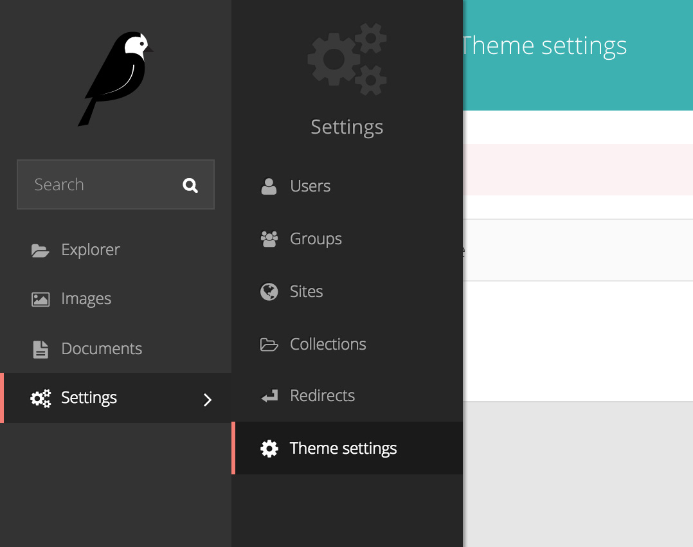

# Wagtail-themes

Site specific theme loader for Django Wagtail.



## Example app

See the [example](https://github.com/moorinteractive/wagtail-themes/tree/master/example) app for a working multisite with two different themes.

Run `make` and the app will install all the necessary files and fixtures for you. 

## Installation

Install the package

```
pip install wagtail-themes
```

Add `wagtailthemes` to your `INSTALLED_APPS`

```python
INSTALLED_APPS = [
    'wagtail.wagtailforms',
    'wagtail.wagtailredirects',
    'wagtail.wagtailembeds',
    'wagtail.wagtailsites',
    'wagtail.wagtailusers',
    'wagtail.wagtailsnippets',
    'wagtail.wagtaildocs',
    'wagtail.wagtailimages',
    'wagtail.wagtailsearch',
    'wagtail.wagtailadmin',
    'wagtail.wagtailcore',

    'modelcluster',
    'taggit',

    'django.contrib.admin',
    'django.contrib.auth',
    'django.contrib.contenttypes',
    'django.contrib.sessions',
    'django.contrib.messages',
    'django.contrib.staticfiles',

    'wagtailthemes',
]
```

Add `ThemeMiddleware` to your `MIDDLEWARE_CLASSES` and make sure its added
after `SiteMiddleware`

```python
MIDDLEWARE_CLASSES = [
    'django.middleware.security.SecurityMiddleware',
    'django.contrib.sessions.middleware.SessionMiddleware',
    'django.middleware.common.CommonMiddleware',
    'django.middleware.csrf.CsrfViewMiddleware',
    'django.contrib.auth.middleware.AuthenticationMiddleware',
    'django.contrib.auth.middleware.SessionAuthenticationMiddleware',
    'django.contrib.messages.middleware.MessageMiddleware',
    'django.middleware.clickjacking.XFrameOptionsMiddleware',
    'wagtail.wagtailcore.middleware.SiteMiddleware',
    'wagtail.wagtailredirects.middleware.RedirectMiddleware',
    'wagtailthemes.middleware.ThemeMiddleware',
]
```

Now make sure the `ThemeLoader` is added to your `loaders` config in the setting
`TEMPLATES`. Note that Django by default adds `APP_DIRS` to the setting, which
conflicts with defining your custom `loaders` config.

Also note that the `ThemeLoader` must be placed on the top of the list
(otherwise default templates will be found first).

```python
TEMPLATES = [
    {
        'BACKEND': 'django.template.backends.django.DjangoTemplates',
        'DIRS': [
            os.path.join(BASE_DIR, 'templates'),
        ],
        # Remove 'APP_DIRS': True at this position
        'OPTIONS': {
            'context_processors': [
                'django.template.context_processors.debug',
                'django.template.context_processors.request',
                'django.contrib.auth.context_processors.auth',
                'django.contrib.messages.context_processors.messages',
            ],
            'loaders': [
                'wagtailthemes.loaders.ThemeLoader',
                'django.template.loaders.filesystem.Loader',
                'django.template.loaders.app_directories.Loader',
            ]
        },
    },
]
```

Now select where your themes are stored with `WAGTAIL_THEME_PREFIX` which has
a default value of `themes`.

```python
THEME_DIR = 'mythemes'
```

Finally define your to be used themes in the setting `WAGTAIL_THEMES`

```python
WAGTAIL_THEMES = [
    ('brand', 'Brand site'),
    ('personal', 'Personal site')
]
```

## ThemeLoader

The `ThemeLoader` class searches for files in your (see settings above) defined
`DIRS` config for `TEMPLATES`.

In this case templates files will be found in the following order (for this
example code we have set `brand` as theme in our CMS)

1. /myapp/templates/mythemes/brand/
2. /myapp/templates/

Its wise to build your templates as you are used to and only override the
template files you want to customize in your theme.
